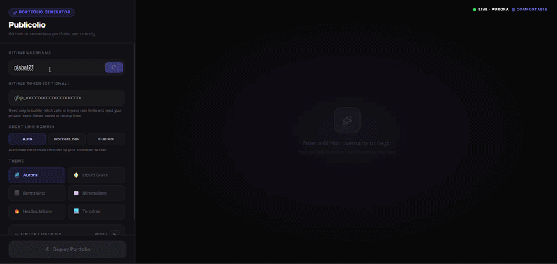

# Publicolio

Publicolio is a zero-configuration GitHub portfolio generator.
It lets you fetch profile data, curate repositories, apply visual themes, and publish a shareable portfolio URL in minutes.



## Highlights

- Fetches profile and repository data from GitHub.
- Supports optional personal access token input in builder mode for private or owner-only repositories.
- Includes 6 portfolio themes with live preview.
- Exposes practical editor controls for layout, typography, card style, and accent color.
- Encodes portfolio state into query parameters for deterministic sharing.
- Supports optional short links through a Cloudflare Worker.
- Supports short-link domain selection (`auto`, `workers.dev`, `custom`).
- Caches builder state for returning users.
- Supports `Update Link` flow to preserve the same short code when backend overwrite is supported.

## Runtime Model

Publicolio runs in two modes:

1. Builder mode
- Activated when `user` and `theme` query params are not present.
- Renders the interactive editor (`LandingBuilder`) to fetch data, choose repos, style output, and deploy links.

2. Renderer mode
- Activated when `user` and `theme` query params are present.
- Renders the final portfolio page (`PortfolioRenderer`) directly from URL state.

## End-to-End Flow

1. Builder calls `fetchDeveloperData(username, token?)`.
2. GitHub profile and repositories are fetched through proxy-aware network logic.
3. Builder composes a long renderer URL from selected repositories and theme options.
4. Builder sends URL to shortener endpoint (if configured).
5. `Deploy Portfolio` creates a new short link.
6. `Update Link` requests same-code overwrite for an existing short URL.
7. If backend does not support same-code overwrite, UI returns a clear update-unsupported message.
8. If shortener fails, app falls back to the full long URL.

## Returning User Cache

Builder state is persisted in `localStorage`.

Cached:

- Username
- Selected theme
- Theme options
- Short-link domain mode
- Last generated short URL
- Per-user repository selections
- Cached profile snapshot for faster restore

Not cached:

- GitHub token (intentionally excluded for safety)

## Themes and Controls

Themes:

- Aurora
- Liquid Glass
- Bento Grid
- Minimalism
- Neubrutalism
- Terminal

Controls:

- Show Avatar
- Show Bio
- Show Stats
- Layout density: `compact` or `comfortable`
- Repository sort: `featured`, `stars`, `name`
- Card style: `soft` or `sharp`
- Text scale: `sm`, `md`, `lg`
- Accent color
- Short-link domain mode: `auto`, `workers.dev`, `custom`

## Technology Stack

- React 19
- TypeScript
- Vite 8
- Tailwind CSS 4
- Lucide React

## Project Structure

- `src/App.tsx` - mode switch between builder and renderer.
- `src/components/LandingBuilder.tsx` - editor UI, fetch flow, repo selection, deploy/update actions.
- `src/components/PortfolioRenderer.tsx` - final portfolio page runtime.
- `src/services/api.ts` - GitHub and shortener network layer.
- `src/components/themes/*` - theme implementations.

## Quick Start

Prerequisite: Node.js 20+

1. Install dependencies.

```bash
npm install
```

2. Create local environment file.

```bash
cp .env.example .env
```

PowerShell alternative:

```powershell
Copy-Item .env.example .env
```

3. Start development server.

```bash
npm run dev
```

4. Build for production.

```bash
npm run build
```

5. Preview production build locally.

```bash
npm run preview
```

## Environment Variables

Create `.env` from `.env.example` and configure the following:

| Variable | Required | Description |
|---|---|---|
| `VITE_CORS_PROXY_URL` | Yes | Proxy prefix for GitHub requests. Format: `https://your-proxy.workers.dev/?url=` |
| `VITE_SHORTENER_URL` | Recommended | Primary shortener API endpoint, typically `https://your-shortener.workers.dev/api/shorten` |
| `VITE_SHORTENER_API_URL` | Optional | Backward-compatible alias for shortener endpoint |
| `VITE_SHORTENER_WORKERS_DOMAIN` | Optional | Domain used when short-link mode is `workers.dev` |
| `VITE_SHORTENER_CUSTOM_DOMAIN` | Optional | Domain used when short-link mode is `custom` |

Notes:

- `VITE_SHORTENER_URL` and `VITE_SHORTENER_API_URL` are both supported.
- If shortener config is missing or fails at runtime, deploy still returns a usable full URL.

## Cloudflare Worker Contracts

Reference implementations:

- Shortener worker gist: [https://gist.github.com/nishal21/ba187199cd00ea6623b6cf4407e3a48d](https://gist.github.com/nishal21/ba187199cd00ea6623b6cf4407e3a48d)
- CORS proxy repository: [https://github.com/nishal21/portfolio-cors-proxy](https://github.com/nishal21/portfolio-cors-proxy)

### CORS Proxy Worker Contract

Expected frontend request:

- `GET {VITE_CORS_PROXY_URL}{encodeURIComponent(targetUrl)}` where proxy base ends with `?url=`
- Optional request header: `X-Custom-GitHub-Token`

Expected proxy behavior:

- Returns `400` when `?url=` is missing.
- For GitHub API targets, forwards either:
  - user token from `X-Custom-GitHub-Token`, or
  - worker secret `GITHUB_TOKEN`.
- Includes CORS headers allowing `X-Custom-GitHub-Token`.

### Shortener Worker Contract

Expected endpoint:

- `POST /api/shorten`

Frontend payload:

```json
{
  "longUrl": "https://...",
  "url": "https://...",
  "shortCode": "existing-code-when-updating",
  "code": "existing-code-when-updating",
  "slug": "existing-code-when-updating"
}
```

Update-link requirement:

- To support `Update Link` without changing URL, worker must reuse provided code and overwrite existing KV value.
- If worker always generates random codes, frontend will show an explicit update-unsupported message.

Accepted response fields:

- `shortUrl`
- `shortened_url`
- `short_url`
- `url`

Redirect behavior:

- `GET /:code` returns HTTP `302` to original long URL.

KV binding:

- Bind KV namespace as `URL_DB`.

## URL Parameters (Renderer)

- `user`: GitHub username
- `theme`: theme key
- `repos`: comma-separated repository names
- `stats`: `1` or `0`
- `avatar`: `1` or `0`
- `bio`: `1` or `0`
- `accent`: hex color without `#`
- `layout`: `compact` or `comfortable`
- `sort`: `featured`, `stars`, or `name`
- `card`: `soft` or `sharp`
- `text`: `sm`, `md`, or `lg`

## Deployment

Publicolio is a static frontend and can be deployed on any static host.

Production checklist:

1. Configure required VITE variables on your hosting platform.
2. Deploy and verify CORS proxy worker.
3. Deploy and verify shortener worker.
4. Point custom short-link domain to shortener worker if using `custom` mode.

### GitHub Actions Auto Deploy

Included workflow:

- `.github/workflows/deploy-pages.yml`

Workflow behavior:

1. Runs on every push to `main`.
2. Installs dependencies and builds the Vite app.
3. Uploads `dist/` as a Pages artifact.
4. Deploys automatically to GitHub Pages.

Build-time env values are read from GitHub Actions Variables (preferred) and also supported via Secrets:

- `VITE_CORS_PROXY_URL`
- `VITE_SHORTENER_URL`
- `VITE_SHORTENER_API_URL`
- `VITE_SHORTENER_WORKERS_DOMAIN`
- `VITE_SHORTENER_CUSTOM_DOMAIN`

## Domain Setup Template

Recommended hostname split:

- Shortener: `short.example.com`
- App: `app.example.com`

### GitHub Pages Custom Domain

1. In repository Settings -> Pages, set Source to `GitHub Actions`.
2. Set custom domain to `app.example.com`.
3. Enable HTTPS after DNS verification.
4. Add DNS record:
   - Type: `CNAME`
   - Name: `app`
   - Target: `username.github.io`
5. Keep `public/CNAME` aligned with your custom app domain.

Important:

- DNS target must be host-only (`username.github.io`), not a URL path.

If using default project URL:

- `https://nishal21.github.io/Publicolio/`

## SEO and GEO Baseline

Included assets and metadata:

- `index.html` with canonical, robots directives, Open Graph, Twitter tags, geo tags, and JSON-LD.
- `public/robots.txt` with sitemap reference and crawler directives.
- `public/sitemap.xml` with canonical homepage URL.
- `public/llms.txt` for AI/LLM crawler guidance.
- `public/og-cover.png` for robust social previews.

## Troubleshooting

### Deploy Fails or No Short Link

1. Verify shortener endpoint env value.
2. Verify worker route includes `/api/shorten`.
3. Verify worker accepts `longUrl` payload.
4. Check browser network errors (CORS, 400, 500).
5. Use fallback full URL if shortener is unavailable.

### Update Link Does Not Preserve Code

1. Ensure worker accepts `shortCode`, `code`, or `slug`.
2. Ensure worker overwrites KV mapping for existing code.
3. Ensure redirect endpoint returns `302` with updated destination.
4. If frontend shows update-unsupported, backend returned a different code.

### GitHub Fetch Issues

1. Verify `VITE_CORS_PROXY_URL`.
2. Verify proxy forwards GitHub status and response body.
3. For private repos, provide a valid token in builder mode.

## Contributing

Please review [CONTRIBUTING.md](CONTRIBUTING.md) for setup, quality checks, and pull request guidelines.

## License

Licensed under the MIT License. See [LICENSE](LICENSE).

## Author

Created by Nishal K.

- GitHub: [@nishal21](https://github.com/nishal21)
- Instagram: [@demonking.___](https://instagram.com/demonking.___)